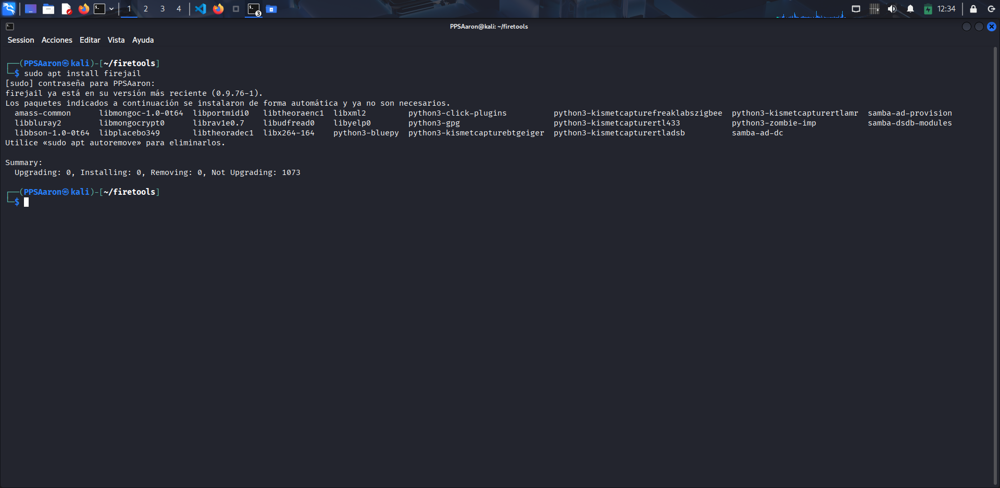
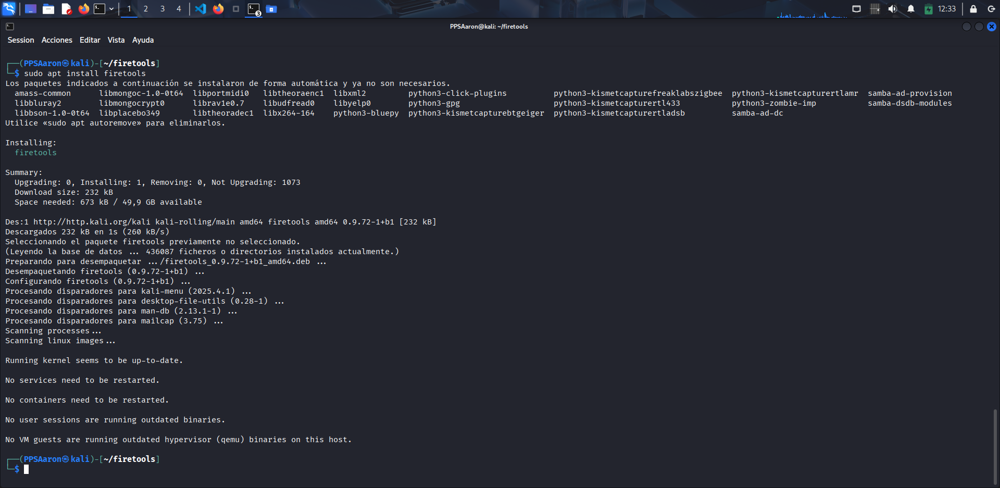
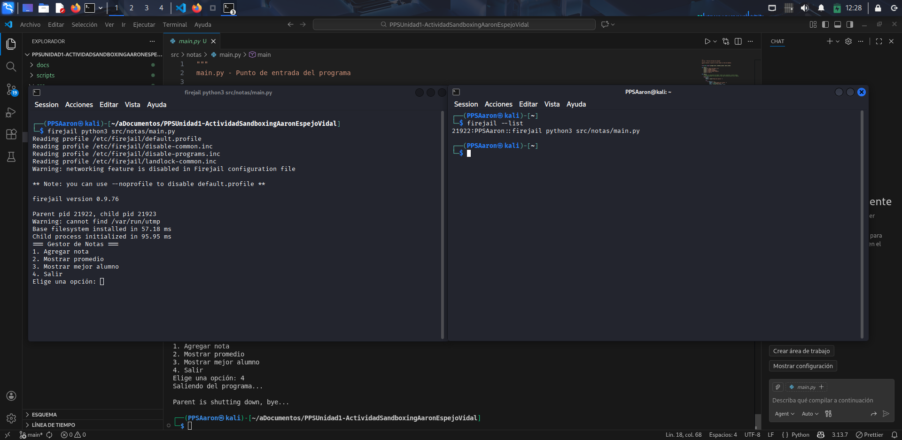

# Documentación para la parte de Sandbox con Firejail
Lo primero que hay que hacer es instalar la herramienta, en mi caso como lo estoy haciendo en Kali Linux es con el comando: ```sudo apt install firejail firetools```

*En mi caso he ejecutado los comandos por separado pero se puede hacer al mismo tiempo*



Una vez hecho esto ya podemos ir a la carpeta de nuestro programa y ejecutar el main.py con firejail, para esto utilizamos el siguiente comando: ```firejail python3 src/notas/main.py```, este comando le dice a Firejail que ejecute un entorno sandbox con python3 y ejecute el archivo ```main.py```.

*No he sido capaz de ejecutarlo con Jailtools por eso lo hago a través de la terminal con el comando de Firejail*


Como se puede ver en la imágen el programa se ha ejecutado con Firejail en un sandbox, esto también lo podemos verificar con el comando ```firejail --list```, este comando nos dice los distintos entornos que se están ejecutando en Firejail.
